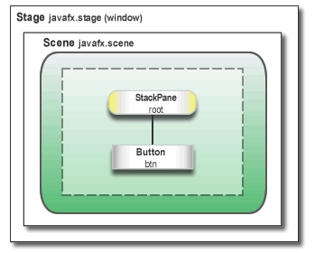

# FX
Intro to the JavaFX Library

Official tutorials and documentation can be found [here](https://docs.oracle.com/javafx/2/get_started/jfxpub-get_started.htm#)

# 1 - HelloFX
### Minimal Working Window

##### General components of a stage.
